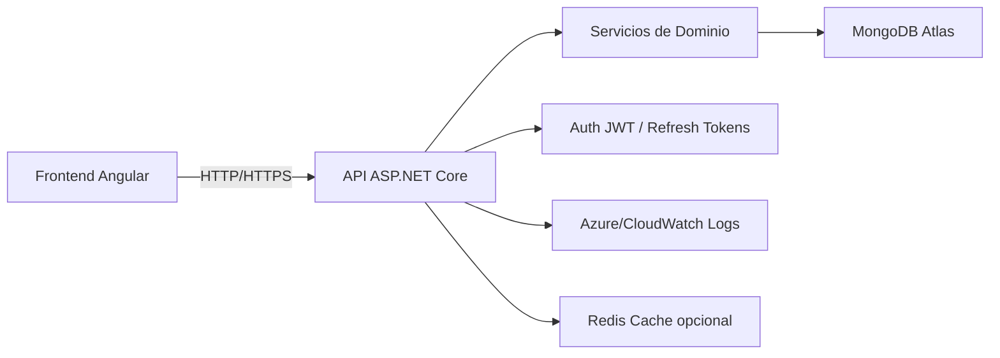
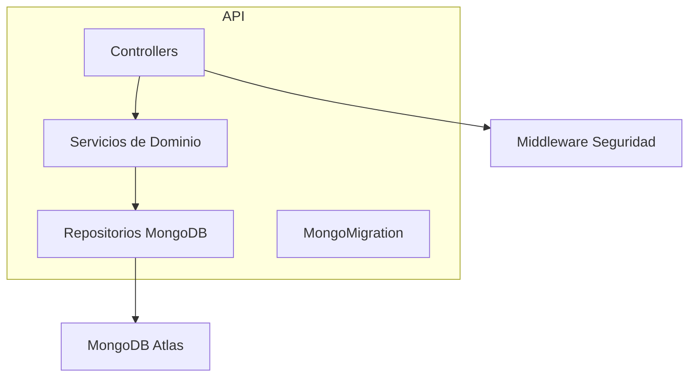
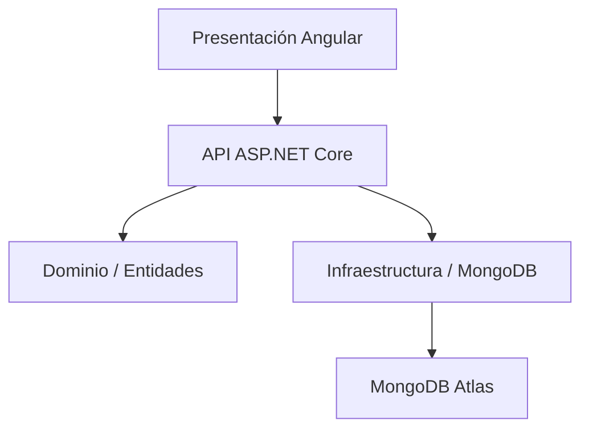
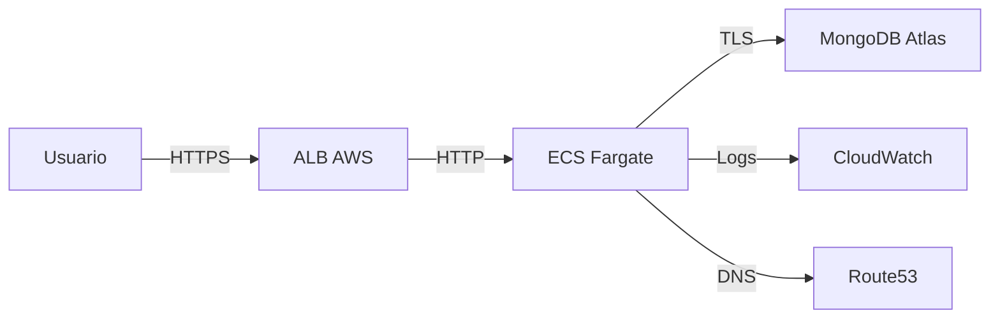
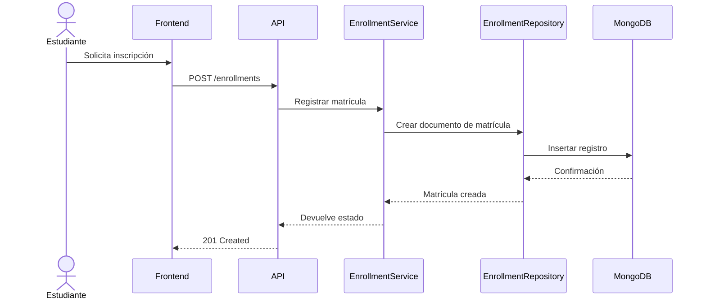
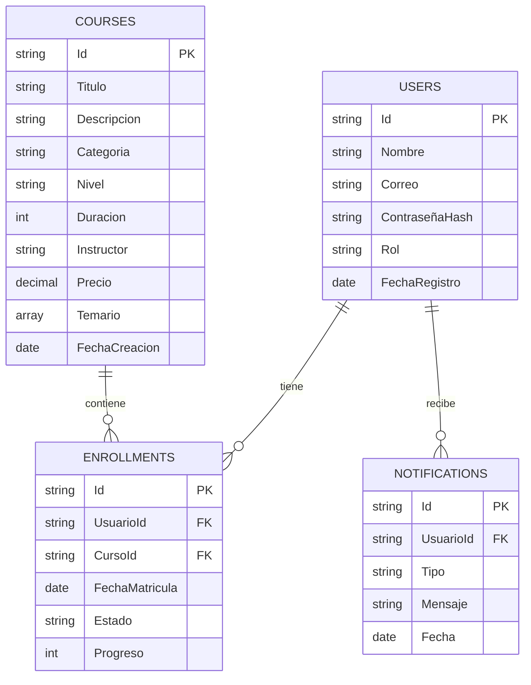

# 2. Arquitectura de Software

## Principios arquitectónicos
La solución está diseñada con:
- Clean Architecture
- Domain Driven Design (DDD)
- Repository Pattern
- Unit of Work
- Dependency Injection
- SOLID
- CQRS cuando se requiera separación lectura/escritura

## Diagrama de Arquitectura General

## Diagrama de Componentes

## Diagrama de Capas

## Diagrama de Despliegue

## Diagrama de Secuencia para matrícula

## Diagrama ER equivalente para MongoDB

