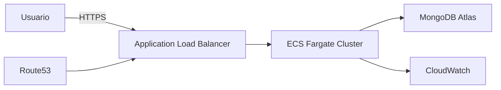

# 7. Infraestructura Cloud

## Selección de AWS
La capa de aplicación se despliega en AWS para aprovechar escalabilidad, balanceo y seguridad.

## Componentes AWS
- **VPC** privada y pública.
- **Subred pública** para Load Balancer.
- **Subred privada** para ECS Fargate.
- **Security Groups** para capas de aplicación.
- **Application Load Balancer** para distribuir tráfico.
- **ECS Fargate** para contenerizar la API.
- **Route53** para DNS.
- **CloudWatch** para logs y métricas.
- **MongoDB Atlas** como base de datos externa administrada.

## Buenas prácticas de seguridad
- Uso de subredes privadas para contenedores.
- Restricción de puertos en Security Groups.
- HTTPS en ALB y certificados gestionados.
- Roles IAM mínimos para ECS.
- Logs centralizados en CloudWatch.

## Diagrama de infraestructura

